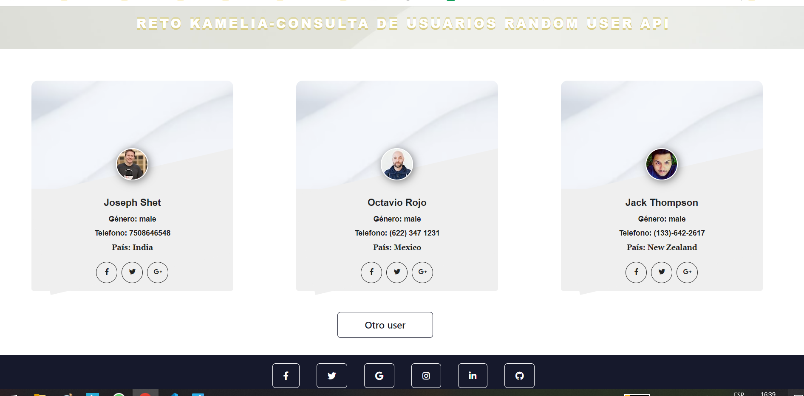
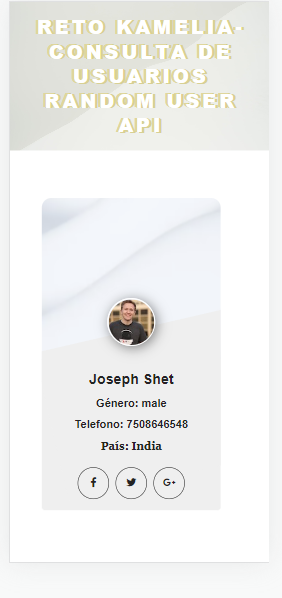

# Reto-RandomUser
App que permite  traer de manera aleatoria usuarios de la api 
- [Demo](https://reto-random-user.vercel.app/)

**Preview**

##### INSTALACION
Ejecute `npm install` para descargar las dependencias de la aplicación.

Para este proyecto se utilizo

- [REACT VITE](https://vitejs.dev/guide/)
- [BOOTSTRAP](https://getbootstrap.com/docs/5.0/getting-started/introduction/)
- [WEBPIXELS](https://webpixels.io/)
- [AXIOS](https://www.npmjs.com/package/axios)

### `npm run dev`

Ejecuta la aplicación en el modo de desarrollo.
Abra [http://localhost:5173](http://localhost:5173) para verlo en su navegador
